# Shaymin
- [ギラティナ](https://github.com/SehataKuro/Giratina)をもとに音楽の再生機能などの基本的な機能だけを実装したミニバージョンです。
- ギラティナは更新しますがこちらのシェイミは更新しません。ギラティナを参考に修正したりしてください。ytdlpを更新しないと音楽が再生できなくなるかもしれません。
- バグが残ってるかもしれませんが自己責任でお願いします。
# 導入の仕方
ほぼ[これ](https://qiita.com/1ntegrale9/items/aa4b373e8895273875a8)と一緒です。これを参考に解説します。

違う点は、3のリポジトリをシェイミに変えることだけだと思います。
## 目次
- [0. 必要なもの](#0-必要なもの)
- [1. Discord Bot のアカウントを作成](#1-discord-bot-のアカウントを作成)
    - [アカウントの作成](#アカウントの作成)
    - [アカウントの設定](#アカウントの設定)
    - [botの初期設定](#botの初期設定)
    - [アクセストークンの取得](#アクセストークンの取得)
    - [サーバに登録](#サーバに登録)
- [2. GitHub のアカウントを作成](#2-github-のアカウントを作成)
- [3. テンプレートからリポジトリを作る](#3-テンプレートからリポジトリを作る)
- [4. Heroku のアカウントとアプリを作成](#4-heroku-のアカウントとアプリを作成)
## 0. 必要なもの
- Discordのアカウント
- GitHubのアカウント
- Herokuのアカウント
## 1. Discord Bot のアカウントを作成
### アカウントの作成
まず、[DEVELOPER PORTAL](https://discordapp.com/developers/applications/)にログインします。

右上の「New application」をクリックします。

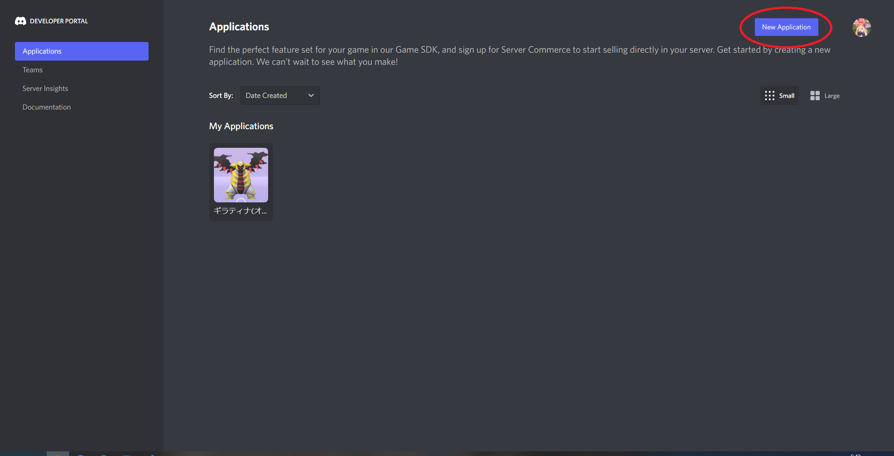

これがBotの名前になるので好きな名前を入れます。
名前を入れたら「Create」をクリックします。

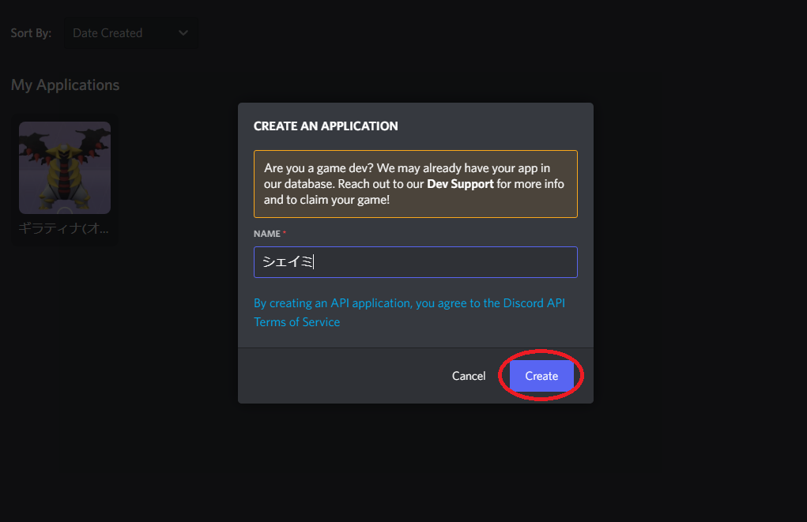
### アカウントの設定
アカウントの管理画面が表示されます。
アイコンや名前を変更することができます。

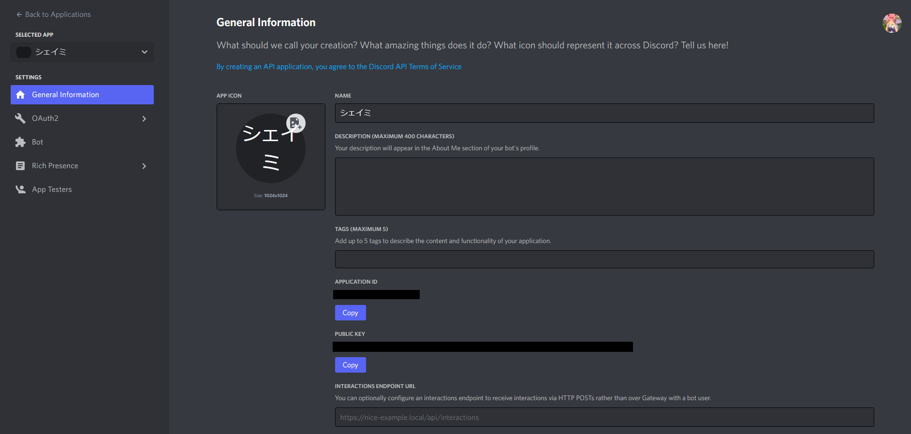
### Botの初期設定

先ほど作ったアカウントをBotにするための設定をします。

タブの「Bot」をクリックします。

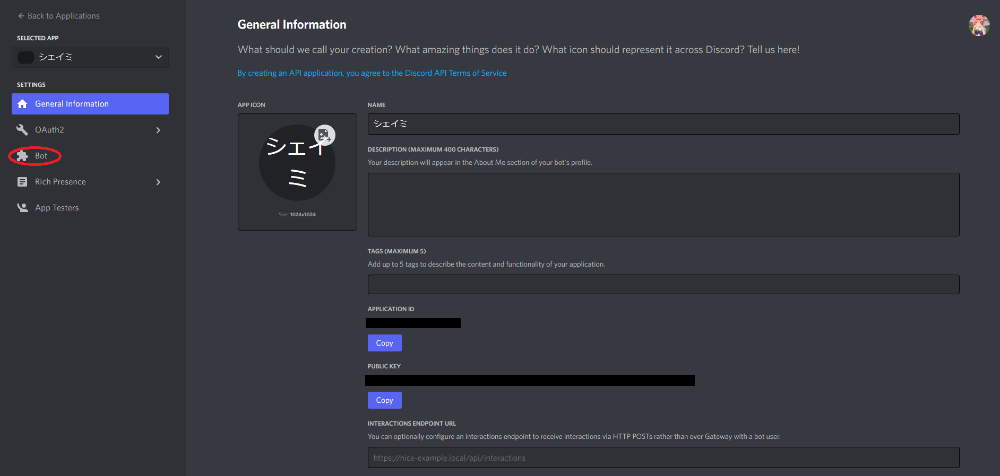

「Add Bot」をクリックします

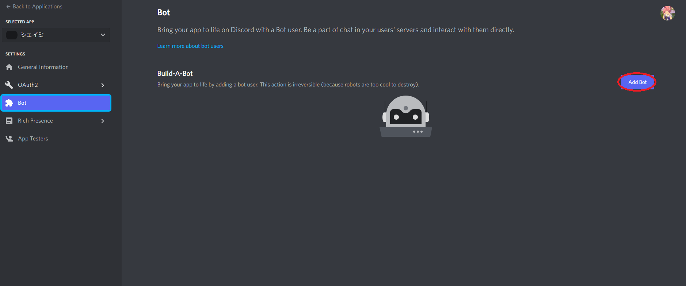

「Bot ユーザとして稼働させると二度と元に戻せないよ！」ということを言っています。

問題がないので「Yes,do it!」をクリックします。

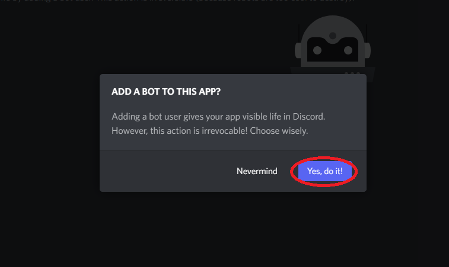
### アクセストークンの取得
「Reset Token」をクリックしてトークンを取得します。

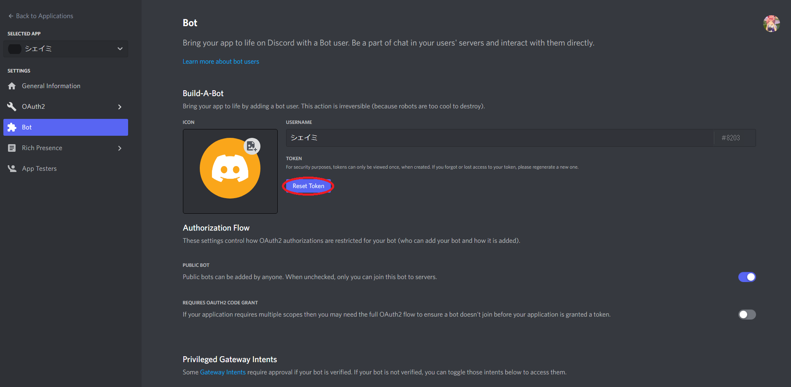

問題がないので「Yes,do it!」をクリックします。

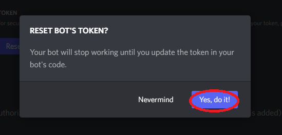

アクセストークンはプログラムからBotを操作するために必要な文字列です。

ここで表示されるトークンを用いてBotを動かします。

***注意　アクセストークンを知られるとBotが乗っ取られる危険性が高いため、必ず誰にも見えない場所に保存してください！***
### サーバに登録
Botをサーバーに入れるための作業をします。

タブの「OAuth2」をクリックし、「URL Generator」をクリックします。

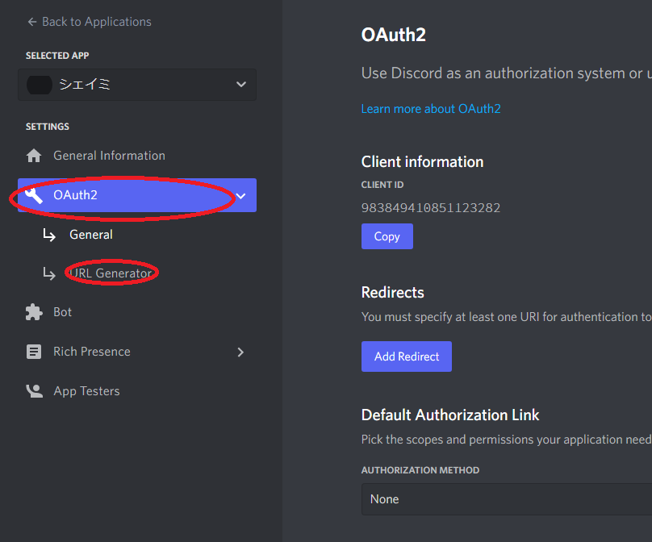

「Bot」と「Administrator」にチェックを入れます。

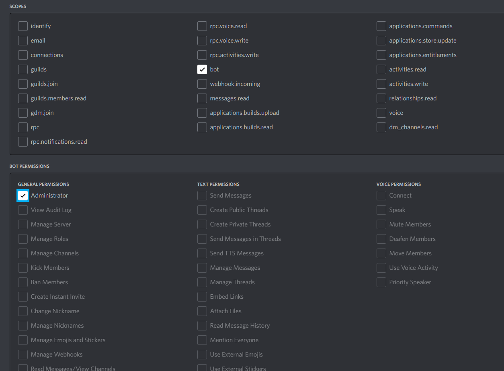

すると、下にURLが生成されるのでそれを開いてBotをサーバーに追加します。
## 2. GitHub のアカウントを作成
- アカウント作成 [https://github.com/join](https://github.com/join)

そんなに難しくないので、省略します。
## 3. テンプレートからリポジトリを作る
- シェイミのリポジトリ [https://github.com/SehataKuro/Shaymin](https://github.com/SehataKuro/Shaymin)

「Use this template」をクリックします。

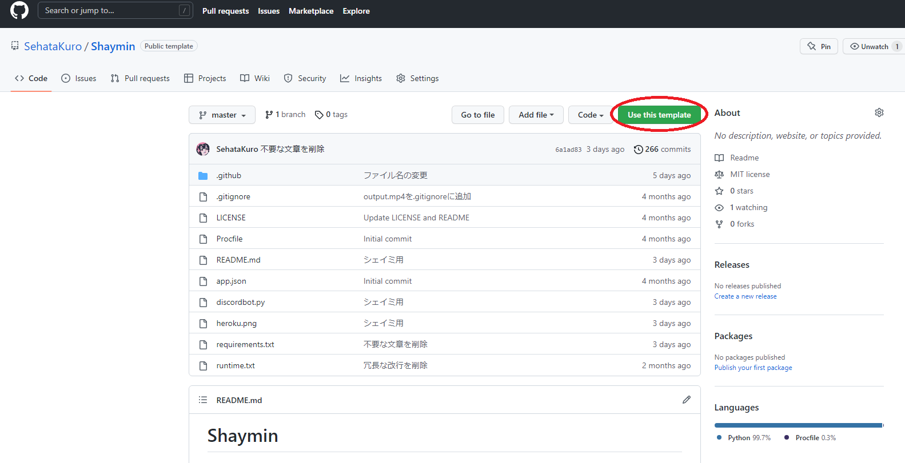

好きな名前を入れます。公開したくない場合はPrivateにチェックを入れます。

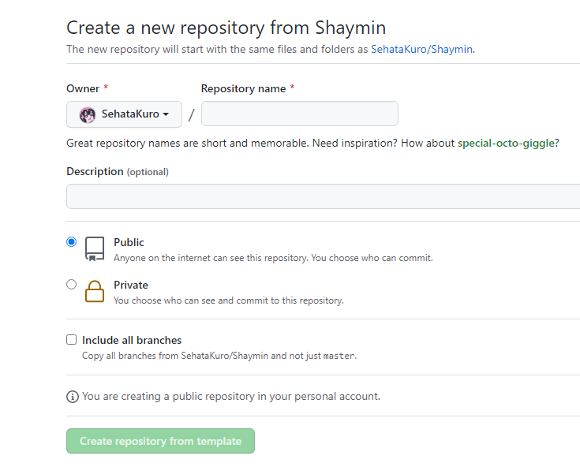

## 4. Heroku のアカウントとアプリを作成
アカウント作成　[https://signup.heroku.com/](https://signup.heroku.com/)

アプリ作成　[https://dashboard.heroku.com/new-app](https://dashboard.heroku.com/new-app)

### Heroku にアクセストークンを設定

Settings の Config Varsに、

KEY に `DISCORD_BOT_TOKEN`

VALUE に 先ほど作ったDiscordのトークンを入れます。

### ビルドパックを設定
このBotに必要なビルドパックはこの3つです。

URLを入れて「Add buildpuck」をクリックします。

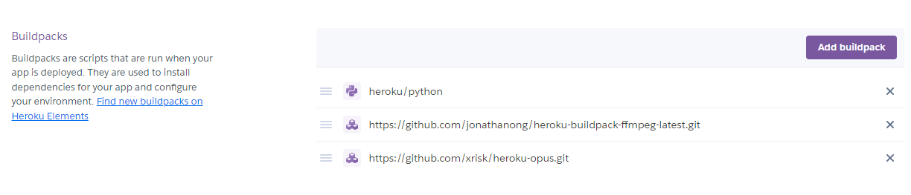
### Heroku アプリと GitHub リポジトリを連携
こんな感じになるようにさっき作ったリポジトリを連携してください。

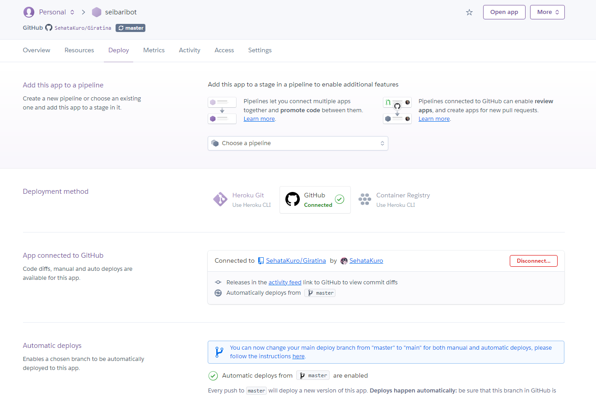
### Dynosの設定
バーを右にスライドして起動します。

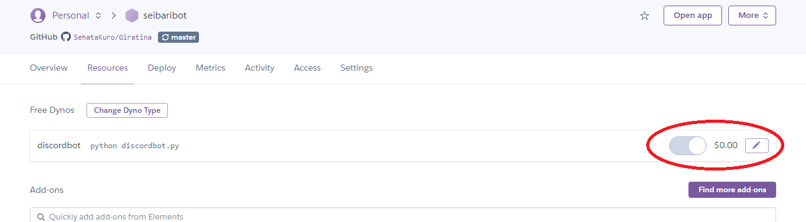

これでDiscordのBotが使えるか確認して、使えたら導入は成功です。
# コマンド
## メインコマンド
### !help
コマンド一覧を表示します。
### !ping
BotサーバーとDiscordサーバー間のPingを表示します。
## 音楽系コマンド
### !join
ボイスチャンネルにBotを追加するためのコマンドです。  
コマンドを使う人がボイスチャンネルに参加している必要があります。
### !leave
ボイスチャンネルからBotを退出させるコマンドです。
### !nowplaying, !np
再生している曲の情報とリンクを表示するコマンドです。
### !play, !p
曲を流すコマンドです。大抵のサイトに対応しています。  
リンクでの再生のほか、検索ワードでの再生も対応しています。  
再生中に曲を追加するとキューに追加されます。
### !queue, !q
キューを表示するコマンドです。  
現在再生中の曲と以降再生される10個の曲を表示します。
### !skip, !s
現在再生中の曲をスキップするコマンドです。  
キューが残っている場合には次の曲を再生します。
### !shuffle
キューをシャッフルします。
### !stop
曲を止めるコマンドです。キューもリセットされます。